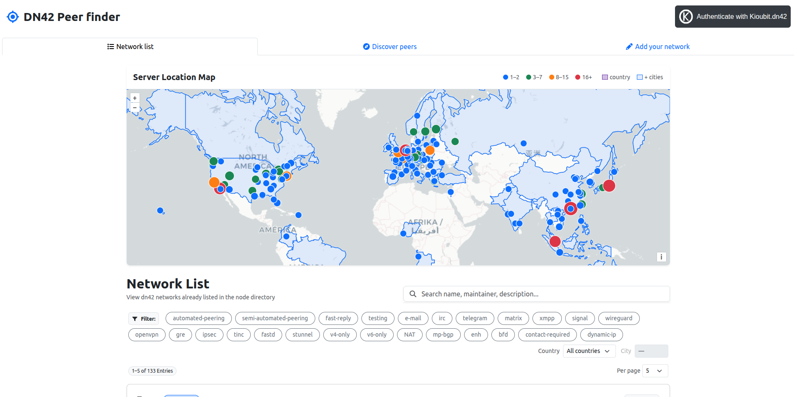
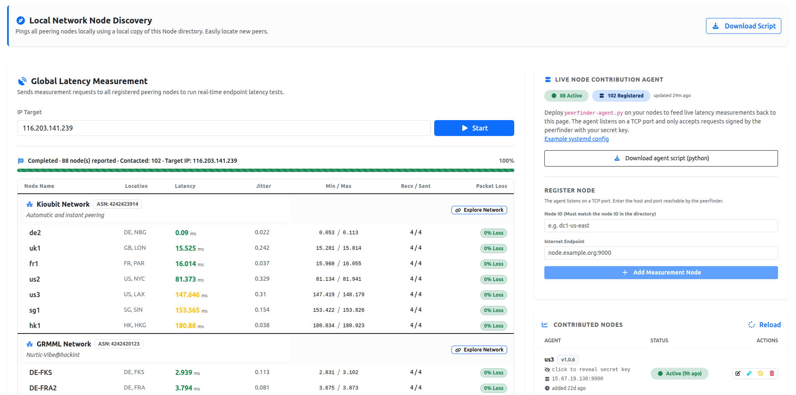

# dn42 Peerfinder

A directory of [dn42](https://dn42.dev) networks designed to help members discover and establish BGP peerings.

| Landing Page                            | Discover Page                          |
|----------------------------------------|-----------------------------------------|
|  |  |

## Features
- Interactive directory and map of dn42 network nodes
- Member authentication and self-service editing of directory entries for members
- Real-time global latency measurements using an authenticated protocol and distributed measurement agents
- Lightweight Python measurement agent that listens for TCP connections from the server and returns measurement results

### Design
- Frontend: Vue.js + TypeScript
- Backend: Go + SQLite + YAML
- Measurement agent: Python (protocol formally verified with Verifpal)
